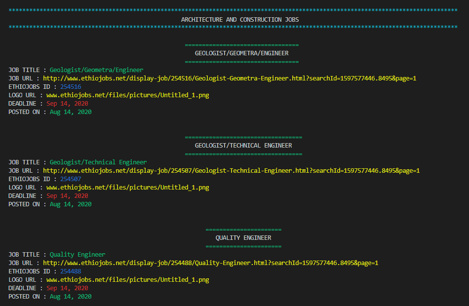

# Ruby Scraper
> This project is a web scrapper project built using the Ruby programming language. The website scrapped in this project is the largest job posting platform in Ethiopia i.e. [Ethiojobs](https://www.ethiojobs.net)

## Demo

[Demo Video](https://youtu.be/srQt5iKcu-Y)

## Built With
- Ruby
- RSpec
- Rubocop
- Nokogiri
- Colorize

## Requirements
- The project should demonstrate scrapping of atleast one web page
- The code should demonstrate Object Oriented Design
- The workflow used should be Git flow
- Public methods should be tested
- It is recommended to use Nokogiri for scraping
- A code linter should be setup

## Getting Started
- Clone the project in to your computer using `git clone https://github.com/DejazmachMolla/ruby-scrapper.git` 
- `cd` into the `ruby-scrapper` folder
- run `bundle install`
- run main.rb file by entering `bin/main.rb` or type `rspec` to `run tests`
- The following picture will show the result of the scrapping

## Authors

:bust_in_silhouette: **Dejazmach Molla**

- Github: [@DejazmachMolla](https://github.com/DejazmachMolla)
- Twitter: [@DJATSS](https://twitter.com/DJATSS)
- Linkedin: [Dejazmach Molla](https://www.linkedin.com/in/dejazmach-getachew-027aabaa/)

## Show your support

Give a ⭐️ if you like this project!

## Acknowledgments

- Microverse